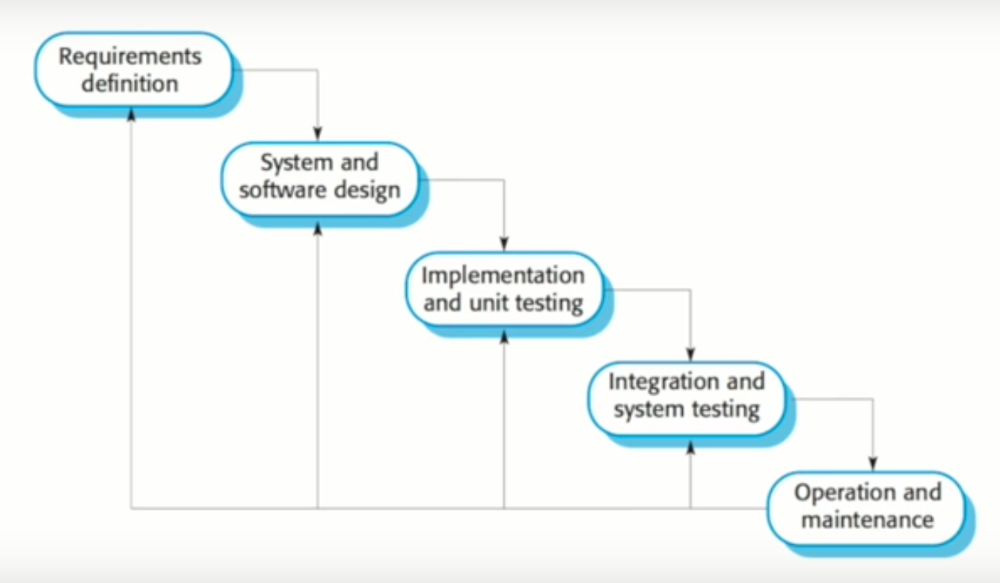
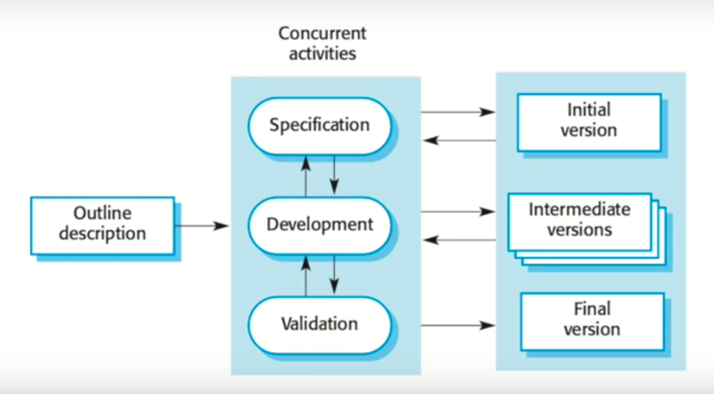
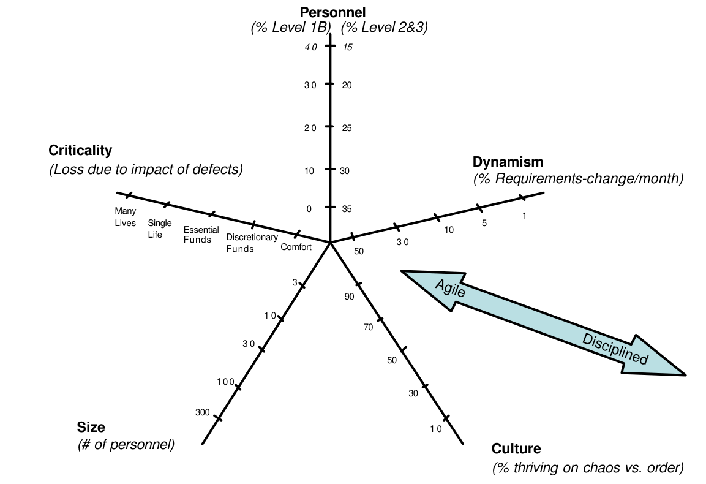
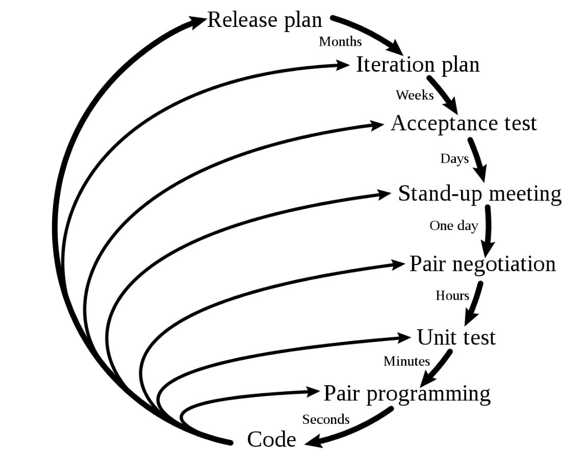
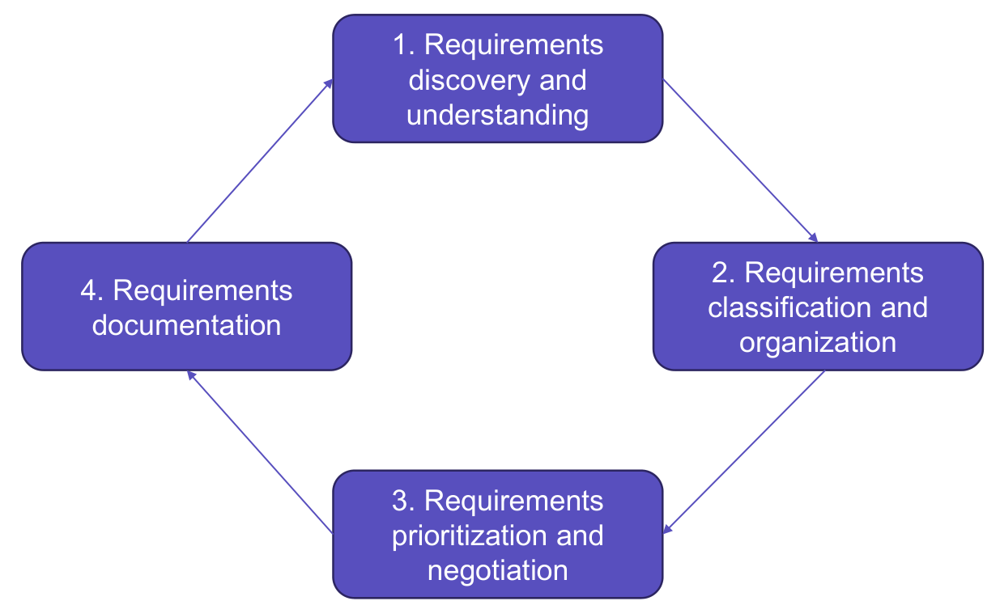
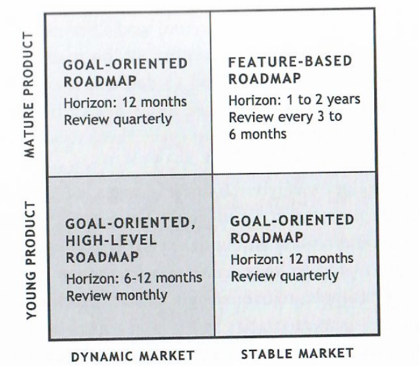
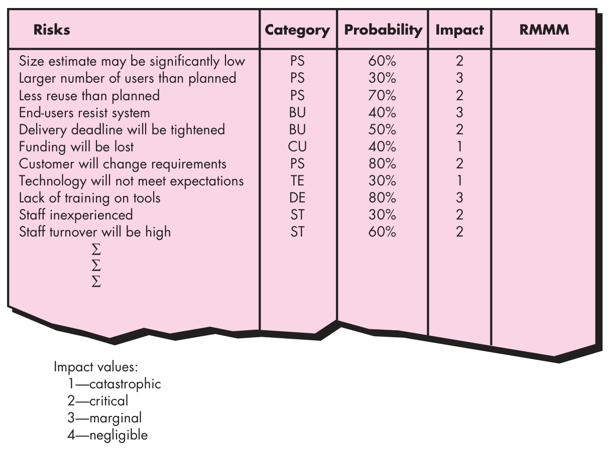
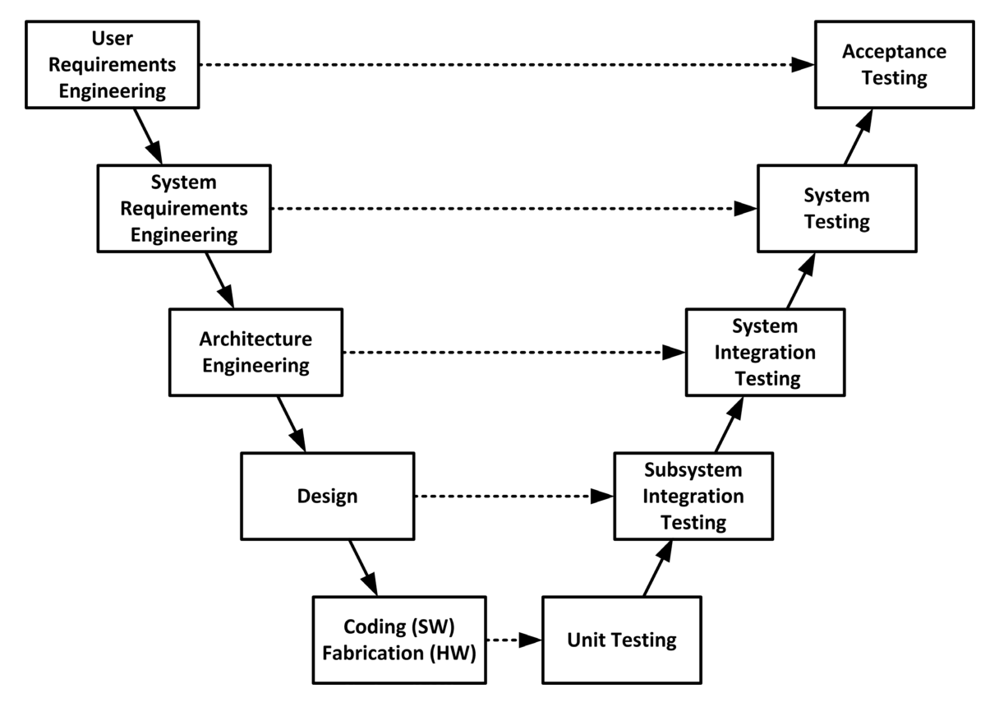
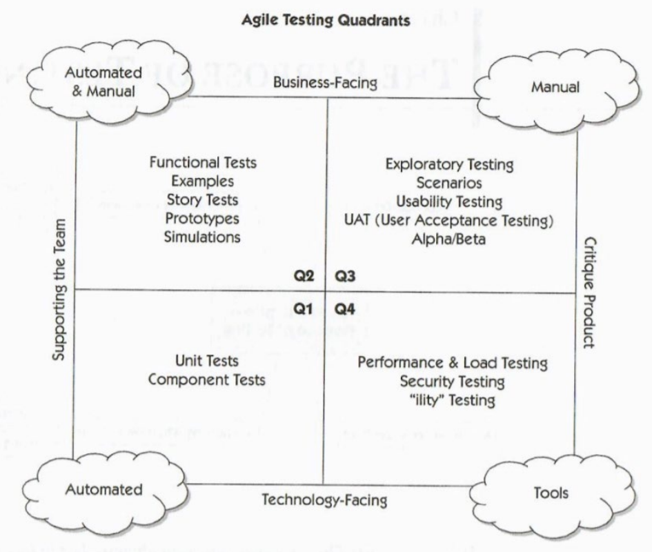
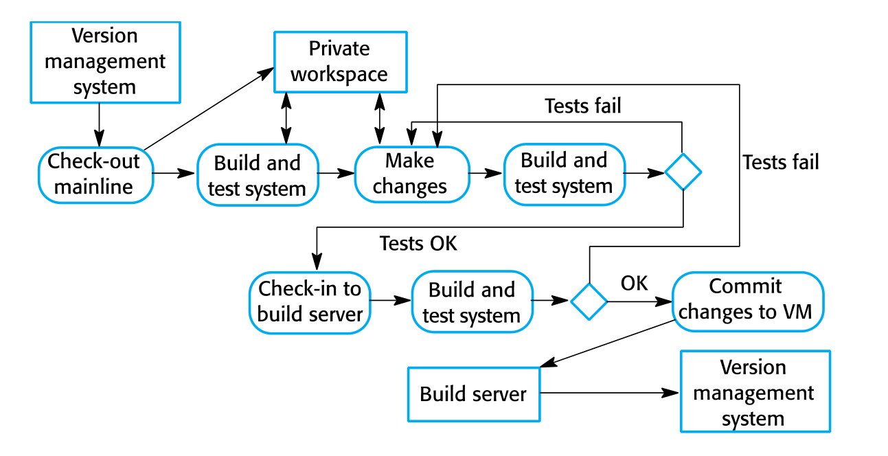

### **Marp**

Markdown Presentation Ecosystem

https://marp.app/

---

### Software Process Model - waterfall

- Software process activities
- Plan driven
- Document driven
- When to use?

---

### Software Process Model - incremental/iterative

- Software process activities
- Plan driven or agile
- When to use?

---

### Comparison of plan-driven and agile

- Documentation
- Feedback
- Change
- What to use and how to choose?

---

### Key features of Scrum

---

### Key features of XP

- Pair programming
- Customer on-site
- TDD
- Collective ownership

---

### Product Planning and Refinement

---

### Risk Management

- Risk assessment
- Risk control
- Common risks
- Plan-driven vs Agile

---

### Quality Management

- Quality Assurance
- Quality Control
- Quality culture

---

### Test

---

### Configuration Management and DevOps

- Change management
- Version management
- System building
- Release management
